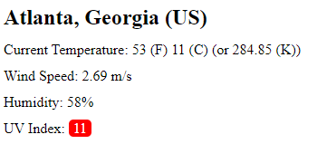

# Weatherbyme
A weather page for simple predictions and forecasts

## Page URL
https://dsamuelson.github.io/Weatherbyme/

## Repo URL
https://github.com/dsamuelson/Weatherbyme

## Instructions and information

This is a simple weather and forecasting application. The point is to get the current, desired, weather stats and then the statistics for the next 5 days.

The page will always load with the information for Atlanta Georgia and from there you can search for other cities like New York for example!

if the UV index is above certain thresholds you will see the index colors change:

You can search for any Cities you like and the cities will be saved in an easily clickable button to the side that you can use to revisit the searches you made previously for weather in certain cities:

Thank you for choosing to work with my page! Good luck!